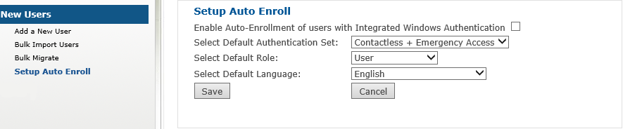

# Configure Auto-Enrollment

Auto Enroll enables you to configure auto enrollment for users who exist in Active Directory. 

Each user who accesses 2FA ONE Server without having already been setup in the system will automatically be enrolled with the default values set here. 

Only one set of defaults is possible. Manually added users via Add New User or Bulk Import take precedence over users who are added as part of Auto Enroll.

### To Setup Auto-Enrollment:
* Select the Setup Auto Enroll submenu.
* Select the Enable Auto-Enrollment of users with Integrated Windows Authentication check box on the Setup Auto Enroll page. 
* Select the desired default authentication set from the Select Default Authentication Set dropdown box.
* Select the desired default role from the Select Default Role drop-down box.
* Select the desired default language from the Select Default Language drop-down box.
* Select Save to commit your changes or Cancel to exit

#### Notes:
If you have a small group of users who will be using a different authentication set or have different roles
than the vast majority of your users, consider adding that small group of users first via Add a New User or Bulk Import Users. 

Then, set the default values to what your vast majority of users will be enrolling, and your administration for new users is done. 

The users added before will retain their specified settings, while each other user that enters the system will automatically receive the defaults entered here. 

This can be a considerable time-saver when deploying strong authentication.
