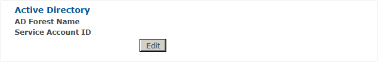
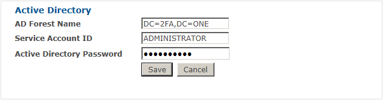
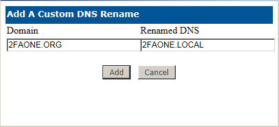
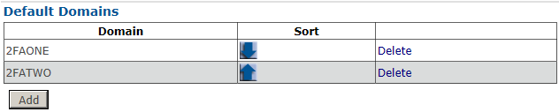

# Active Directory Method

This sub-menu provides the functionality of enabling PKI, enabling users to authenticate to a system utilizing their Active Directory user name and password, and disabling Active Directory accounts. 

Depending on the features desired, you must enter an account that has read permissions to the forest root and has account password change/reset and change account control permissions throughout the forest or the domains in which users’ passwords are managed. 

An account in the domain admin group has both of these permissions. If the account password is changed within Active Directory, it will need to be updated in this screen to avoid potential errors. 

Click Edit to input or change the AD account information.
1. To configure the Active Directory Method you must enter the Distinguished Name (such as: dc=2FAONE,dc=local) of your Active Directory Forest and your method service account and service account password. 

2.	When you are done, click Save. 
3.	Once you have configured the Active Directory Method, the screen will display the saved information and the capability to edit the saved information.

### Domain DNS Mapping

Domain DNS Mapping can be used when there are problems with the domain information returned when the 2FA ONE queries Active Directory. In rare cases this may happen when upgrading domains from legacy Microsoft domain structuring.

1.	To add a new Domain DNS Mapping, click Add 
2.	In Domain field, enter the name of the original domain that will be translated. In the Renamed DNS, enter the name of the domain to which the original name will be translated. In other words, with Domain 2faONE.org and Renamed DNS of 2faONE.local, server will identify user1 @2faONE.org as user1 @2faONE.local

### Default Domains
Default Domains allows you to identify the domains that can be selected from the drop down when logging onto the 2FA ONE Server.

1.	Click Add to configure the list of domains in addition to None from which you can select when logging into 2FA ONE Server.
2.	Enter a desired domain (ex 2FAONE) and click Add 3. If you have added multiple domains, you can use the arrows to move a domain up or down in the list, or click Delete to remove that domain.
