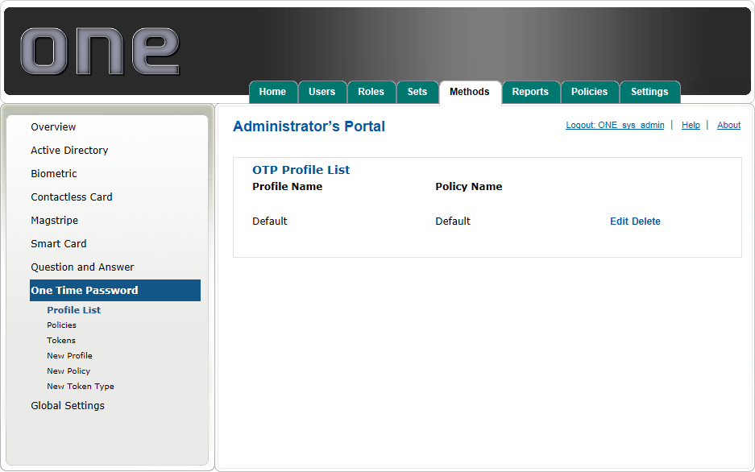
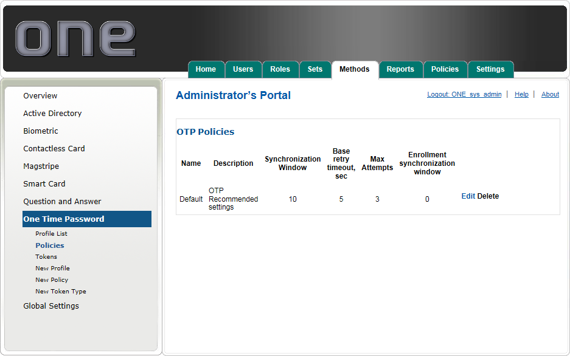
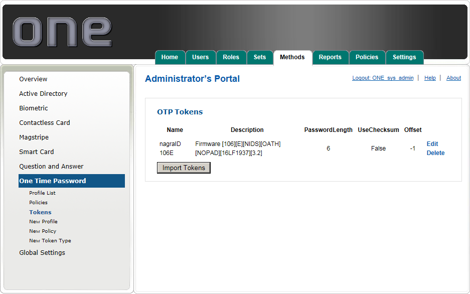
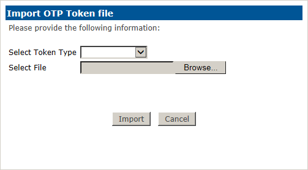
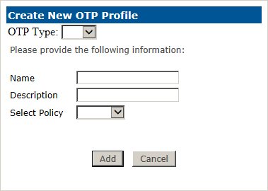
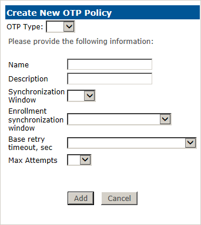
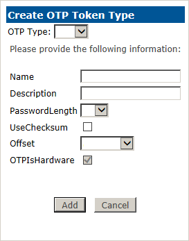
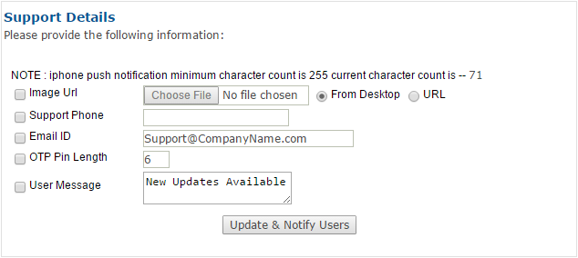

# One Time Password (OTP) Method

The One Time Password (or OTP for abbreviation) submenu enables you to configure profiles and policies for logon using physical OTP Tokens or our 2FA ONE Mobile app.

Within the OTP submenu there are six submenus, they are:

**Profile List:**	Provides an overview of the configured OTP Profiles, including the configured policy.

**Policies:** Provides the ability for organizations to establish OTP usage policies and selection criteria for securing OTP Tokens protected with a timeout of the token and max attempts.

**Tokens:**	Manage or import Tokens to be included in an OTP Profile.

**New Profile:**	Provides the ability for organizations to create custom profiles that can pair with OTP policy with Sets and assigned to users.

**New Policy:**	Provides the ability to create custom OTP policies for OTP authentication.

**New Token Type:**	Provides the ability to configure the OTP type with your desired settings		

### Profile List

By default, 2FA ONE Server has a single profile for OTP Tokens. The Default profile contains the following settings:

Default OTP Policy of:
1. Synchronization Windows = 10
2. Base retry timeout, sec = 5
3. Max Attempts = 3
4. Enrollment synchronization window = 0 (Token Maximum Counter)

### PIN Policies

The OTP policy submenu provides the ability for organizations to create custom OTP policies and edit the out-of-the-box OTP Default policy. 

By default there is only one OTP policy. The default OTP Policy contains a policy based upon best practices. The OTP Policy can be edited or you can create your own OTP policy. 

Once created the OTP policy is assigned to a Profile that can be assigned to a Set; then, the Set can be assigned to a user. with what we recommend for best case.

### Tokens

The OTP Tokens submenu provides the ability for organizations to import their tokens within 2FA ONE Server. 

This allows the use of those tokens within our environment. By default we have the nagraID106E created, which can be used when importing your token csv file. 

To import your tokens, you will need to do the following:

1.	Click on the Import Tokens button and you will get an Import OTP Token file popup window.
2.	On the Select Token Type select the token type.
3.	Click the Browse button and you will get an Choose File to Upload file popup window
4.	Navigate and select your CSV file, then click the Open button. 

You will receive import successful message and now your tokens are ready for use.

### New Profile

In order to assign a new Profile to a Set you must first create the new Profile. To create a new Profile, click the New Profile link and the New OTP Profile pop-up will appear. 

Enter a Name and Description for the new profile, select the desired OTP Policy. Once you have made your desired selection, click the Add button.

### New PIN Policy

In order to assign a new OTP Policy to a Profile you must first create the new OTP Policy. To create a new OTP Policy, click the New Policy link, and the Create New OTP Policy pop-up will appear. 

You must name the new policy and select your desired settings.

* **Synchronization Window:**	This number represents how wide the range is when we search for the OTP keys upon login.
* **Enrollment synchronization window:**	This number represents how wide the range is when we search for the OTP keys upon enrollment.
* **Base retry timeout, sec:**	This number represents how long we wait before allowing another attempt with the OTP Token.
* **Max Attempts:**	This number represents how many attempts until the token is locked out.
* **Note:**	The default settings for new OTP Policy is designed for best practices.

### New Token Type

In order to import new OTP Tokens you must first create a new OTP Token. By default we have nagraID106E available for importing your tokens in the Tokens portion of this section. 

 

You can utilize just this one for current and future tokens you import. If you would like to create custom Token Type click the New Token Type link, and the Create New OTP Token Type pop-up will appear. 

You must name the new policy and select your desired settings.

* **Password Length:** This number represents how long the OTP password will be.
* **UseChecksum:**	Do not modify unless told by the manufacturer of the token
* **Offset:**	Do not modify unless told by the manufacturer of the token

### Notify Users

The Notify Users section is for our Soft Token feature of OTP. 

Within this section you can send a custom image url, input a support phone number and email address, the OTP PIN length and send them a message. 

This will send a notification to all the users currently enrolled in Soft Token.

To send a custom image or send a message. You would check mark what you would like to send and press the Update & Notify Users button.

* **Image URL:**	Allows you to have an custom logo on our 2FA ONE Soft Token App
* Support Phone:**	Allows you to input a support number within the 2FA ONE Soft Token App
* **Email ID:**		Input a support email address within the 2FA ONE Soft Token App
* **OTP PIN Length:**	Allows you to notify the users of their PIN length
* **User Message:**	Allows you to notify the users of any critical information or downtime
 
