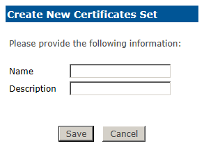

# Smart Card Method

The Smart Card sub-menu enables you to configure PIN policy for contact smart cards, and assign those to profiles for use in authentication sets. 

Within the Smart Card submenu there are four submenus, they are:

1.	**Profile List:** Provides an overview of the configured Smart Card card Profiles. 
  2.	Available configurations include:
    3.	**PIN Policy:** Establishes policy for PIN selection
    4.	**Certificate Set:** Defines which certificate template(s) are enabled for the Smart Card card Profile.
2.	**User Notification Settings:** Configures the schedule for notifying users prior to certificate expiration.
3.	**PIN Policies:** Provides the ability for organizations to establish PIN selection policies similar to that
traditionally used with Active Directory passwords.
4.	**Certificate Sets:** Manage certificate templates, card enrollment settings, and CSP selection to be included in a Smart Card card Profile.
5.	**New Profile:** Provides the ability for organizations to create custom profiles that can then be paired with
Sets and assigned to users.
6.	**New PIN Policy:** Provides the ability to create custom PIN policy beyond that delivered by default with 2FA ONE Server.
7.	**New Certificate Set:** Configure new set containing certificate templates, card enrollment settings, and CSP selection to be included in a Smart Card card Profile

### Profile List

1.	Default PIN Policy of:
  2.	Attempts before PIN becomes blocked = 3
  3.	Minimum PIN Length = 4
  4.	No more than three repeated characters
  5.	No more than three consecutive characters
  6.	Note: Smart Card or Tokens may have their own hard coded PIN policy that may override the 2FA ONE PIN policy if the hard coded PIN policy is more stringent.
2.	Default Certificate Set

### User Notifications Settings

You may automatically notify users prior to the expiration of one or more certificates issued from within 2FA ONE. 

Users will receive an email X days prior to certificate expiration with an embedded link which will allow the user to automatically renew the expiring certificate. 

The user will continue to receive notifications for each of the increments configured until the user successfully renews the expiring certificate.

**Note:** The user must have a valid email address configured within 2FA ONE Server for this feature to work. 

**Also Please Note:** 2FA ONE Server must be configured to support emails, as outlined in the Install and Setup Guide

### PIN Policies

The PIN Policy sub-menu provides the ability for organizations to create custom PIN policies and edit out-of-the-box PIN policies. 

By default there are four PIN policies with varying degrees of security from High to Low. The default PIN Policy contains a policy based upon best practices. 

The default PIN Policy can be edited, or you can create your own PIN policy. PIN policy is assigned to a Profile that can be assigned to a Set; then, the set can be assigned to a user.

### Certificate Sets

Certificate Sets represent single or multiple certificate templates that may be issued to users and user smart cards. This screen displays configured Certificate Sets and allows those sets to be edited and deleted. 

The Default Certificate Set is visible. This certificate set does not contain any certificate templates, but certificate templates may be added by pressing Edit.

### New Profile

Certificate Sets represent single or multiple certificate templates that may be issued to users and user smart cards. 

This screen displays configured Certificate Sets and allows those sets to be edited and deleted.

By default, the Default Certificate Set is visible. This certificate set does not contain any certificate templates, but certificate templates may be added by pressing Edit.

### New PIN Policy

In order to assign a new PIN Policy to a Profile you must first create the new Policy. To create a new PIN Policy, click the New PIN Policy link and the Create New PIN Policy pop-up will appear. 

In the example the New PIN Policy name is “Sample Policy” and the following setting were configured:
1.	Minimum PIN Length = 4
2.	Maximum PIN Length = unconfigured
3.	No more than three repeated characters
4.	No more than three consecutive characters

### New Certificate Set

1.	Certificate Sets allows an administrator to assign one or more certificates to a Certificate Set that can be assigned to a Smart Card Profile and associated with users during contact smart card issuance.

  2.	Provide a Name and Description for the Certificate Set you are creating. Click Save, and the screen will expand to include more information specific to this newly-created Certificate Set. 

2.	Under Certificate Template Name choose the first certificate template that you wish to assign to the set. 
3.	For certificates issued directly to a smart card (for example 2FA ONE Smart card), check the box labelled Enroll directly on a smart card.
  4.	Checking this box will also set the Cryptographic Service Provider Name to Use smart card provider.
3.	Click Add to add the desired template to the Certificate1 will be installed on the user’s smart card. Once you have done this, the template will appear above in the list of Certificate Templates included in this Certificate Set. 
  4.	**Note:** Only check the Enroll directly on a smart card checkbox for templates that need the private key generated on the smart card itself, and do not require the key to be archived. Certificate templates that require key archival and recovery, such as encryption certificates, should not have this checkbox checked. 
  5.	Even though this checkbox is not checked, the certificate will still be imported to the user’s smart card when the issuance process is complete. 
4.	You may repeat step #3 to add multiple certificate templates to this Certificate Set. Be sure to click Add between each template.
5.	Click SAVE when complete.
