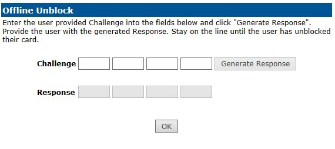
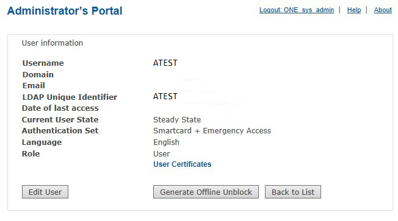
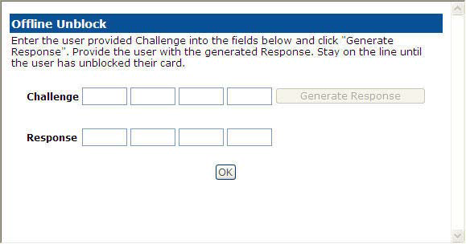
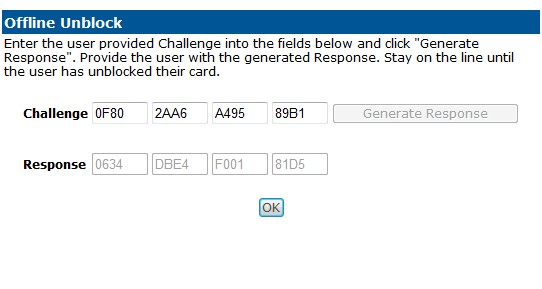
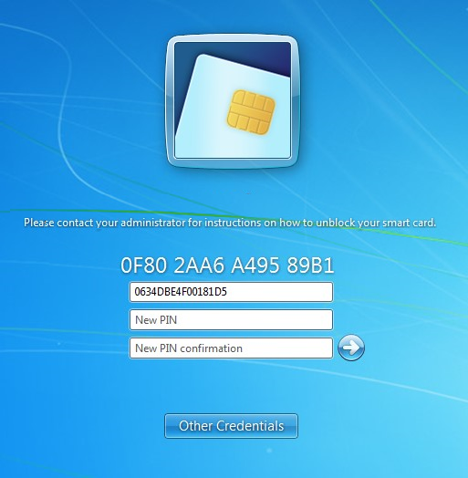

# Mini-Driver Smart Card Offline Un-Block

2FA ONE Server provides the capability for a user to remotely unblock a mini-driver contact smart card that was enrolled via 2FA ONE Server. 
Requirements: The user must have enrolled via 2FA ONE Server. The user must have a mini-driver contact smart card. The user must have access to a Microsoft® Vista or newer operating system. The operating system must have the mini-driver installed locally. Also, Active Directory group policy must be set to “Allow Integrated Unblock screen to be displayed at the time of logon”.

### Process:
The user with a blocked contact smart card will insert the card in to a smart card reader connected to a system running Microsoft® Vista or newer with the mini driver installed. 

Once inserted the PIN collection screen will appear. The user must click the check box that states unblock smart card then contact the help desk. The user will provide the 6-character challenge that is displayed on the screen.

### Step 1

The admin will enter the 2FA ONE Server Administrator Portal and proceed to User Lookup and enter the user’s information. Once located, the User Information screen will appear with the Generate Offline Unblock button enabled. 

**Note:** If the Generate Offline Unblock button does not appear, then the user never enrolled a valid contact smart card within 2FA ONE Server.

### Step 2

Click Generate Offline Unblock, and the Offline Unblock pop-up will open. 

### Step Three
The user will read the challenge code to the admin, and the admin will enter the challenge code into the Challenge field. Once collected, the Generate Response button will become enabled. The admin will click Generate Response. The Response will appear.

### Step Four

The admin will then read the Response to the user, and the user will enter the Response into the Response field within the Unblock Smart Card screen on their system.

**Best Practice:**
Entering an improper Challenge will result in an improper Response. If the user enters an improper Response three times, the Administrator Key for the card will become blocked, disabling the ability to perform any unblocks on that card in the future. 

Therefore, it is recommended to carefully confirm the Challenge prior to generating the response, as well as to carefully confirm the Response prior to the user entering it in the system.
