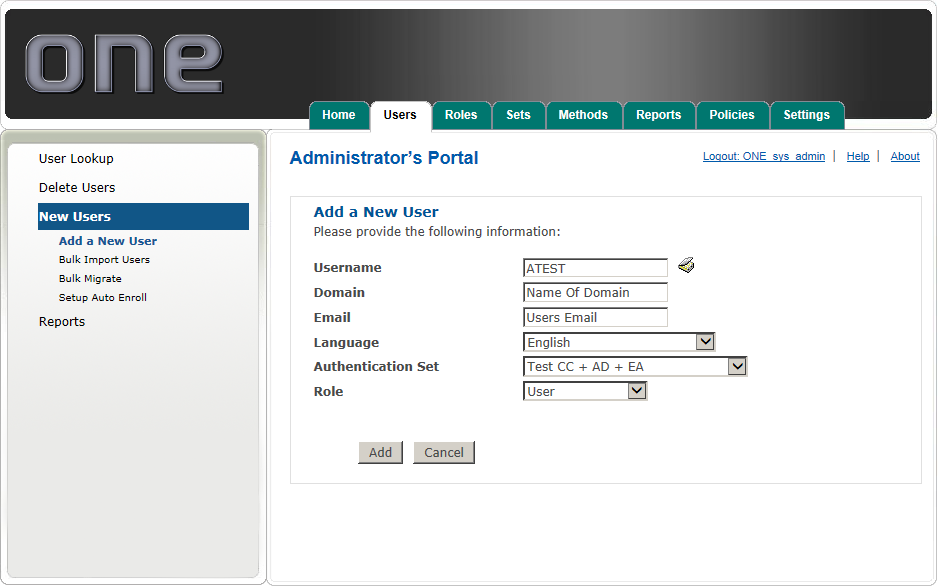

# Add New Users

To add an individual user to the system:

* Enter the user’s **user name**, **domain**, and **email address** in the associated fields.
* As an alternative, you can select the directory lookup tool and navigate to the user’s Active Directory account to select the user.
  * **Note:** In multi-domain environments you MUST add the user's domain or use the AD Lookup Tool.
* Select the user’s **Language**, **Authentication Set**, and 2FA ONE **Server Role**.
* Select Add to commit your changes or Cancel to exit.

