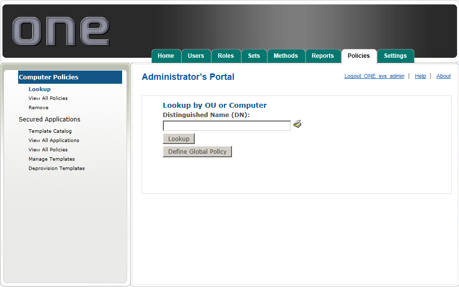
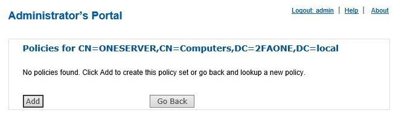

# Add or Edit a Domain, OU, or Computer Policy

For policy conflict resolution computer policy takes precedence over OU policy, and OU over domain policy. 

This section will provide you with information on how to manage policies.

* From the Computer Policies submenu, you are presented with the Look up by Domain, OU, or Computer. You may type the FQDN of the Domain, OU, or Computer object that you wish to create a policy for or click on the directory lookup tool to browse to the AD object that you wish to administer.

* Identify the Domain, OU, or computer you would like to set policy for and click Lookup or OK from with the Directory Lookup tool. If no policy currently exists you must first add the Domain, OU, or computer. Click Add.
  * **Note:**	When selecting a Domain, OU, or computer with the Directory Lookup tool you must first identify the object in the left panel, then select it in the right panel and click Ok. If a policy is already defined for the computer, the defined policy will be displayed as described in the following step. Click Edit to edit the policy.
* Select the checkbox next to the policies that you want to apply. Configure each enforced policy by checking the box next to the setting that you want to configure, use the drop-down menu to select the setting that you want to configure. Click Save to save the policy settings.
  * **Note:** Unchecking a policy will only prevent that policy from being applied in the future, it will not revert any policies already applied to a machine or OU

