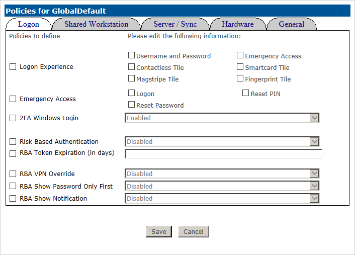
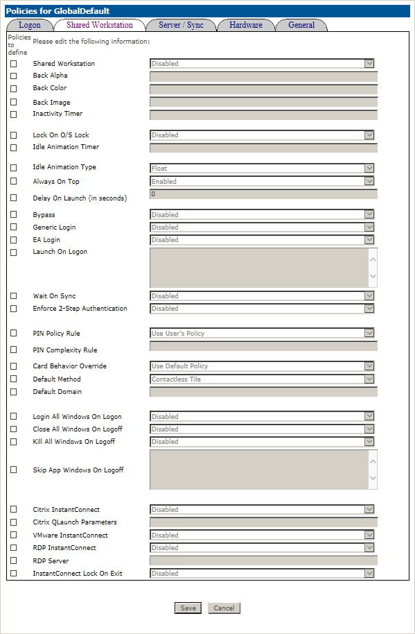
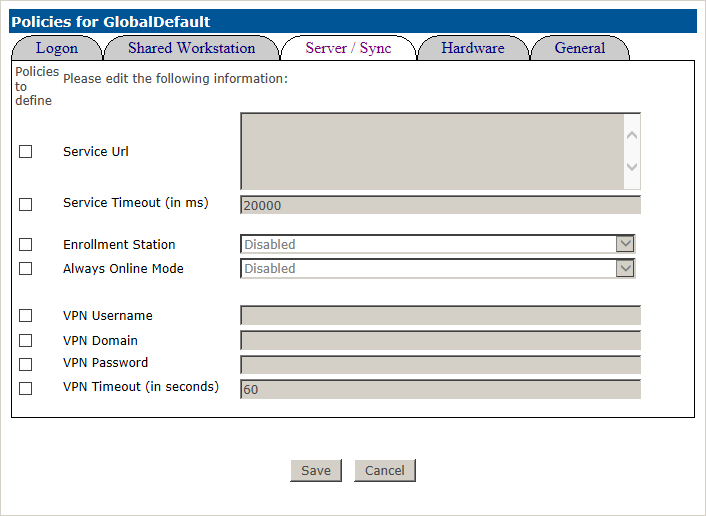
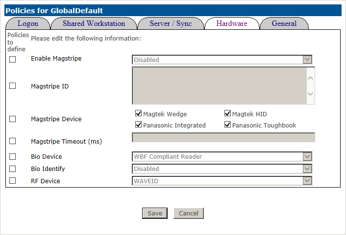
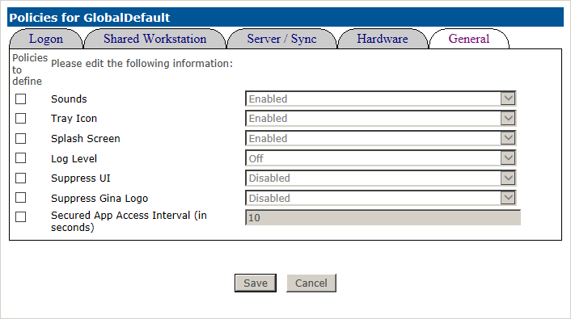

# Policy Descriptions

## Logon Tab

**Logon Experience:** Defines the logon tile options a user will be presented with in Windows logon and SharedWorkstation. Only the boxes checked will be displayed.

**Emergency Access:** Defines the options available after successfully authenticating using the Emergency Access method. Only the options checked will be displayed.

**2FA Windows Logon:** This setting determines whether the 2FA ONE credential providers defined in Logon Experience will be displayed at Windows Logon. Disabling this setting will prevent all 2FA ONE logon methods from being available for Windows Logon.

**Risk Based Authentication:** Defines whether a user will be prompted to use Advanced Authentication to Logon to their Windows Profile. Advanced Authentication is any logon option other than username and password. When Risk Based Authentication (RBA) triggers, the workstation will be locked, and the username and password logon option will not be available.

**RBA Token Expiration (in days):**	Defines the period of time that can pass before a user is required to useadvanced authentication to logon. For example, if RBA Token Expiration is set for 10 days, a user will be required to use advanced authentication once at logon, then will not be prompted again for 10 days. During that period they can use Username and Password. Each time Advanced Authentication is used, the expiration counter resets.	

**RBA VPN Override:** Defines whether or not you will allow RBA to be disabled to allow a VPN connection. Once a VPN connection is established. RBA will prompt for an advanced authentication.

**RBA Show Password Only First:** Requires initial logon via username and password exclusively, then if enabled RBA triggers and requires the user to use advanced authentication to continue the logon process.

**RBA Show Notification:** Will notify the user logging in if RBA is needed.

## Shared Workstation Tab

**Enable or Disable Shared Workstation mode**

**Back Alpha:**
Defines the percentage of opaqueness of the shared workstation login screen from 0 (completely transparent) to 100 (completely opaque)  

**Back Color:**
Defines the color of the shared workstation login / lock screen, in hexadecimal where FFFFFF is white and 000000 is black.

**Back Image:**
Allows you to set the path of a local .jpg .png .bmp or .gif

**Inactivity Timer:**
Defines the amount of time in minutes before Shared Workstation locks when there is no activity.

**Lock On O/S Lock:**
Locks Shared Workstation if the Windows desktop is locked.

**Idle Animation Timer:**
Defines the amount of time in minutes before the shared workstation logon tiles move randomly around the screen. This is a feature to prevent burn in on legacy monitors.

**Idle Animation Type:**
Defines whether to hide or float tiles when timed out.

**Always On Top:**	
Causes shared workstation to stay on top of, covering any other applications. Some users may find this useful to prevent conflicts when working with VPN application that stay on top of other screens to allow logon.

**Delay On Launch (in seconds):**
Defines the delay in seconds until shared workstation launches, after the initial Windows login

**Bypass:**	
When enabled, allows non enrolled users the opportunity to access the desktop by adding a Guest Logon button beneath the standard login tiles.

**Generic Login:**	
When disabled, removes Username and Password from the Shared Workstation login options

**EA Login:**
When disabled, removes Emergency Access from the Shared Workstation login options

**Launch On Logon:**
Allows administrators to configure applications to be launched at user login to Shared Workstation

**Wait On Sync:**
Requires the user profile to sync before allowing logon.

**Enforce 2-Step Authentication:**
Allows only the same user that logged on to the standard desktop at initial Windows logon to logon to shared workstation.

**PIN Policy Rule:**	
Defines whether the user's PIN policy is used for authentication, or allows you to Always or Never Require PIN. 

**PIN Complexity Rule:**
Determines or overrides PIN policy rules for an entire machine, and applies when on that machine to users setting or using a PIN to logon.

**Card Behavior Override:**
Determines or overrides locally set Card behavior. Options are Use Default Policy, Do Nothing, Lock or Logoff upon Card removal or card tap.

**Default Method:**
Defines the default tile presented to users at logon.

**Default Domain:**
Sets the default domain in the dropdown of Username and Password or Emergency Access

**Login All Windows on Logon:**
Attempts to log the current user onto all active application for which Secured Apps templates exist

**Close All Windows on Logoff:**
Closes all windows when a user logs off but does so politely.  In other words, applications which may prompt a user for feedback at logoff (for example, do you wish to save?) will not be shut down if no response is provided.

**Kill All Windows on Logoff:**
Closes all Windows at logoff, regardless of any popups or feedback requests from those applications.

**Skip App Windows on Logoff:**
Used in conjunction with Kill All Windows on Logoff, applications can be omitted from the Kill All Windows operation.

**Citrix InstantConnect:**
Launches Citrix Online Plugin at login if present and submits the logged on users credentials.

**Citrix QLaunch Parameters:**
Allows you to define Citrix Applications to be launched at login

**VMware Instant Connect:**
Launches VMWare View and submits the logged on user's credentials

**RDP InstantConnect:**
Launches Microsoft Terminal Services Client and submits the logged on user's credentials.

**RDP Server:**
Used in conjunction with the RDP InstantConnect feature, this defines the server to be logged onto

**InstantConnect Lock on Exit:**
Automatically locks shared workstation when any InstantConnect application is closed.

## Server / Sync Tab

**Service URL:**
Allows the ability to input multiple 2FA Servers for failover instances.

**Service Timeout (in ms):**
Defines the amount of time the client will continue to attempt to sync when no server can be contacted

**Enrollment Station:**
When enabled, prevents user data from being added to the local cache after enrollment.

**Always Online Mode:**
When enabled, this settings deletes the local user profile cache, requiring the system to have access to it server upon next logon.

**VPN Username:**	
NetMotion VPN Credentials

**VPN Domain:**
NetMotion VPN Credentials

**VPN Password:**
NetMotion VPN Credentials

**VPN Timeout (in seconds):**
NetMotion VPN Credentials

## Hardware Tab

**Enable Magstripe:** Enable or disable use of Magstripe

**Magstripe ID:** Magstripe ID allows you to enter the specific VID and PID hardware identifiers for Magstripe readers. Multiple entries should be placed on different lines.

**Magstripe Device:** Enable use by checking the boxes of the device you will use. WedgeMagtek Wedge, Magtek HID, Panasonic Integrated and Panasonic Toughbook. For generic keyboard output devices, select Magtek.

**Magstripe Timeout (ms):**	Defines the duration of time that 2FA ONE Client will wait before submitting transmitted magstripe data.  Many readers submit data with a carriage return at the end, but for those that do not, enable a small timeout, 1000ms, to ensure the data is submitted.

**Bio Device:**		Dropdown list of the supported types of Fingerprint sensors. Set the appropriate device for the type of reader that will be used in your environment.

**Bio Identify:**		Typically used for older biometric devices as they become non-responsive after a certain amount of time. When this is enabled, this will attempt to restart the device to make it ready when using biometrics.

**RF Device:**		Allows you to specify which RF Device you are using when required. Default policy is WaveID for PCProx, can be set to GETAC to support F110 Tablet embedded reader 

## General Tab

**Sounds:**
When enabled, 2FA ONE Client will produce a sound when a card is presented and read.

**Tray Icon:**
When enabled, a 2FA ONE Icon will appear in the system tray of enrolled users.

**Splash Screen:**
Displays a 2FA ONE window when sync operations are occurring.

**Log Level:**
Sets logging to level 1 (Errors only), 2 (Errors and Messages) or 3 (All data).

**Suppress UI:**
When enabled, prevents users from being able to launch the 2FA ONE Client application user interface.

**Suppress Gina Logo:**
Disabled by default, this legacy feature for Windows XP prevented the 2FA ONE logo from being displayed at the logon screen

**Secured App Access Interval:**
Defines the amount of time the application will wait on a secured app logon prompt before attempting to submit credentials again.