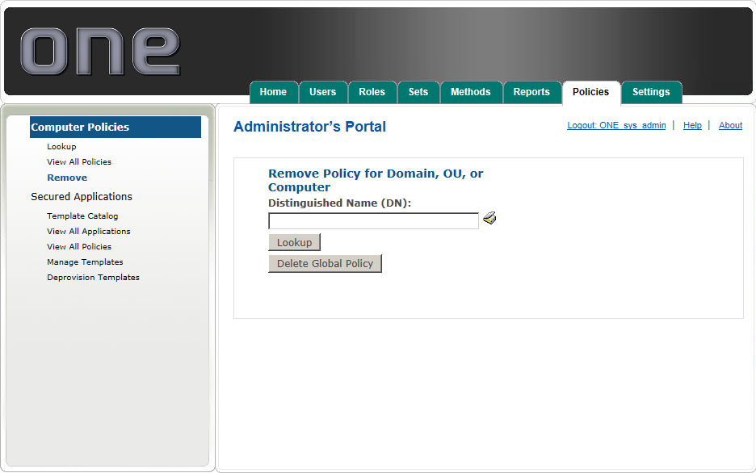

# Remove a Policy

Click Remove under the Computer Policies Menu to remove a given policy from a specific domain, OU or Computer. 

Removing a given policy only prevents it from being applied in the future.  It does not revert policies already applied to a computer(s).