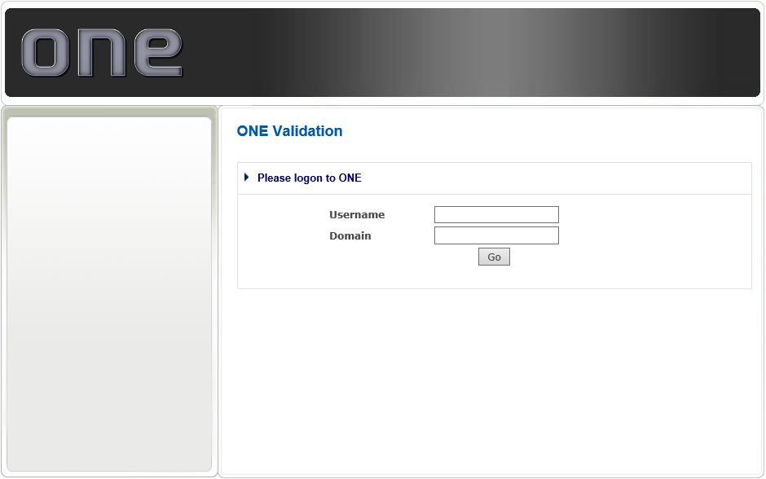
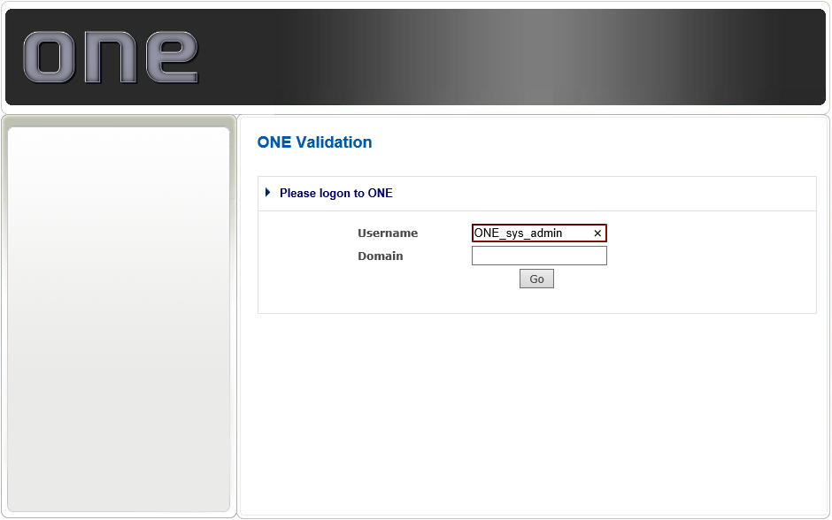
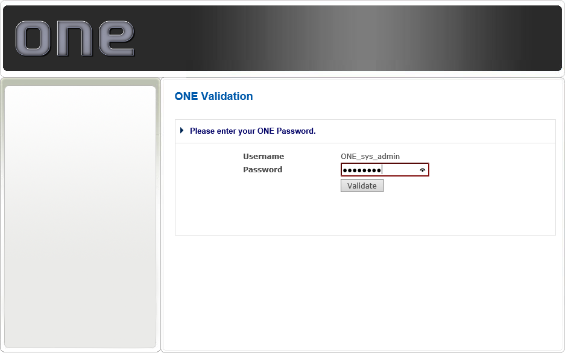

# Accessing the Administrator’s Portal

To access the Administrator’s Portal for the first time you must use the default built-in account: **ONE_sys_admin**. 

This account is the most privileged administrative account (and Role) within 2FA One Server; therefore, care should be exercised when granting access to this account.

**Note:** The ONE_sys_admin account is the account created during the Build 2FA One Server Database step of the Installation and Setup Guide. 

For the purposes of this guide, it’s assumed you left the default name of ONE_sys_admin.

### Follow Along

* To open the portal, go to Internet Explorer and type in **http://[servername].[yourdomain].[topleveldomain]/One/admin_portal** where servername is the name of the IIS server on which 2FA One Server is hosted. The 2FA One Server Logon screen appears.
  * ****Note:**** The domain field is used for multi-domain support, which is useful when duplicate account names exist within different domains. In most cases the domain field may remain blank. In the event of a conflict, the user will be able to select his/her name from a list of user names.

* Because this is the first time that the Administrator’s Portal has been logged onto, Microsoft® Integrated Authentication will not work. 2FA One Server has no current knowledge of accounts existing within your domain. You must enter ONE_sys_admin in the user name field and click Go.
  * Do not enter a domain, as the ONE_sys_admin account is not known within the domain.

* Next, enter the password you selected for this account during the installation process and click Validate.

* You will be granted Access to the 2FA One Server Administrator Portal

### Best Practices
* The **ONE_sys_admin** account is the most privileged role within the system and cannot be deleted or modified.  When created, the account should be secured with a stronger form of authentication than user name and password. 
  * The account can be secured by a smart card, Q&A, or other authentication methods within the system. We strongly recommend that you immediately create a second user account with the ROLE of ONE_sys_admin and conduct configuration and changes with this newly created account to ensure audit data is created appropriately.
  * The ONE_sys_admin account, once secure via a card, can then be stored to be used only in case of emergency.
* To ensure that proper reporting takes place, you should establish individually assigned accounts prior to conducting any configuration within the Administrator’s Portal. 

