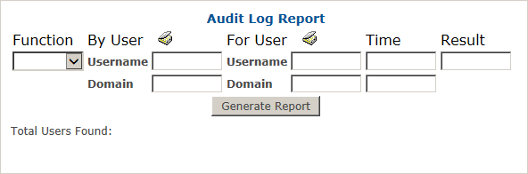
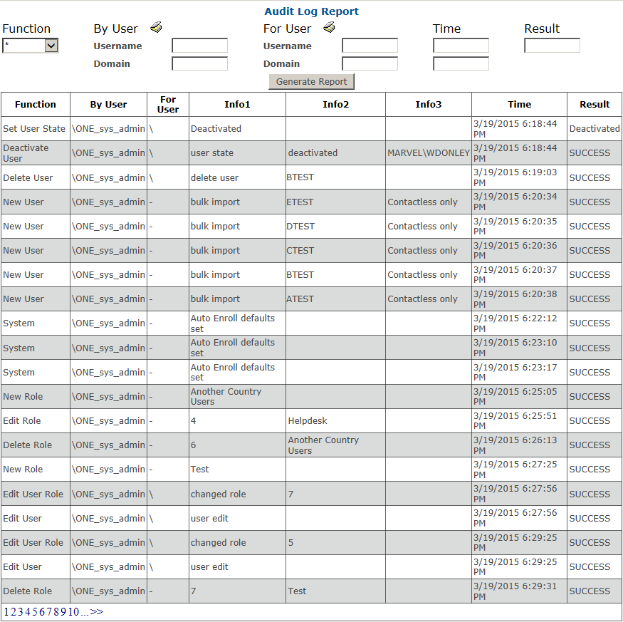

# Reports: By Audit Logs

Reports by audit log, allow you to filter by actions performed, by User, Time, or Result.

To run a report by Audit Logs:

2.	Select Reports tab.
2.	Select the By Audit Logs sub-menu. A pop window will appear.
3.	Click Generate Report to return all audit logs for the system. Note: Reports with a larger number of results may take longer to process.

**Note:**	To narrow down the results of reports by audit logs, enter variables as described below:

* **By User:**	Filter for actions performed by a particular user or user domain. 
* **For User:**	Filter for actions performed on a given user
* **Time:**	Filter for starting and ending date of audit logs
* **Result:** Filter by end results as Success, Failure. 

Then click **Generate Report.**

**Note:** Results requiring more than one page will have links in the lower left hand corner for additional pages.
