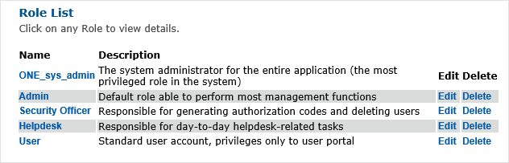

# Role List Sub-Menu

The Role List sub-menu provides an overview of the roles defined within the system. 

By default, there are five predefined roles within 2FA ONE:

1.	ONE_sys_admin
2.	Admin
3.	Security Officer
4.	Help Desk
5.	User

Except for the ONE_sys_admin role, all roles within the system can be edited or deleted. You can edit or delete a role by selecting Edit or Delete from within the Role List sub-menu. 

Editing a role is performed in a manner similar to creating a new role. 

