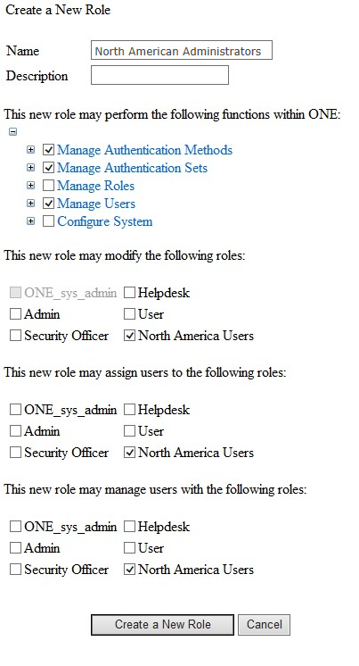

# Delegated Administration with Scope

With Roles you can delegate a role that can only manage defined roles. For instance if you are a part of a global organization where administrators can only manage users within their assigned region, you can create a role named North American Administrators that can only manage users assigned the North American User role. 

1.	To accomplish this, first create the lowest level role. Following our example you will first create the North American User role, assign the North American User role the desired rights and save the new role.
2.	Second you will create the North American Administrators Role and assign the desired rights and add the permission may manage users with the following roles: by selecting North American User. 
3.	You can then repeat this for each region. You could also create special roles such as Executive Administrator and Executive Users that span multiple geographic regions. This ensures that administrators who traditionally manage a defined user-base continue to be restricted to the same user base
