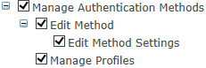
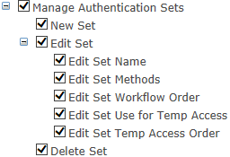
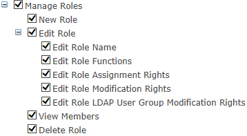
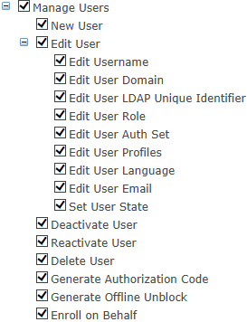
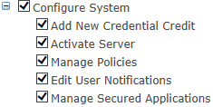

# Creating New Roles

The Create a New Role submenu provides the capability to create new roles within the system. The Create a New Role submenu will display as a pop-up box from which a new role can be created. 

In addition to the new role name and description, there are four primary areas within the dialog:

1.	To create a new role you must first define a name for the new role and provide an optional description in the Name and Description fields. 
2.	Within the ***This new role may perform the following functions within 2FA ONE Server*** section you can assign the privileges to the new role. Select the privileges that are most appropriate for your new role by clicking the associated check box. 
  3.	Please note that the list of permissions is expandable, and you need to grant permissions to the higher level if you expect a user to be able to navigate to the lower options. The only exceptions are the limited “Edit User” functions available in the 2FA ONE Server User
Portal. You will also notice that you can only apply permissions for which you currently have. Therefore, if you are not logged in with an account assigned the ONE_sys_admin role, you may not see all possible permissions in the system.
3.	Within the ***This new role may modify the following roles*** section applies to roles with the “Manage Roles” permission(s) above. Here, you can assign privileges specific to which other roles’ permissions this role can modify. Thus, by default, the Admin role may modify the User role’s or Helpdesk role’s
permissions, but not the Security Officer role. This is another part of enforcing role separation.
Select the privileges that are most appropriate for your new role by clicking the associated check boxes.
4.	Within the ***This new role may assign users to the following roles*** section, you can assign privileges.
This directly determines which roles show up in the Edit User screen (see Section 7.1 for more information).
5.	Select the privileges that are most appropriate for your new role by clicking the associated checkbox.
6.	Within the ***This new role may manage users with the following roles*** section, you can assign
privileges. This directly determines which users show up in the User Lookup screen (see Section 7.1 for more information). For example, if you have a certain User role called “Executives” and are creating a special Helpdesk group called “Executives Helpdesk”, you can assign the Executive Helpdesk role to only manage users with the Executives role. This can be used to create unique role separation between management of different user groups/roles. 
7.	Select the privileges that are most appropriate for your new role by clicking the associated checkbox.
8.	Click Create Role to commit your changes or Cancel to exit the menu. 

The following lists reflect the complete range of rights that can be assigned to a role:

#### Manage Authentication Methods

Functions include all administrative tasks associated with individual logon methods supported by 2FA ONE:

* Edit Method
* Edit Method Settings
* Manage Profiles

#### Manage Authentication Sets

Functions include all administrative tasks associated with managing Authentication Sets:

* New Set
* Edit Set
  * Edit Set Name
  * Edit Set Methods
  * Edit Set Workflow Order
  * Edit Set Use for Temp Access
  * Edit Set Temp Access Order
* Delete Set

#### Manage Roles

Functions include assigning and managing user and administrative roles within 2FA ONE. Role management is a highly comprehensive method of delegating permissions within 2FA ONE and establishing a separation of duties within the system:

* New Role
* Edit Role
  * Edit Role Name
  * Edit Role Function
  * Edit Role Assignment Rights
  * Edit Role Modification Rights
  * Edit Role LDAP User Group Modification Rights
* View Members
* Delete Role

#### Manage Users

Functions include all administrative tasks associated with user lifecycle management and personal settings. Virtually every 2FA ONE administrator will have some level of responsibility for user management:

* New User
* Edit User
  * Edit User Name
  * Edit User Domain
  * Edit User LDAP Unique Identifier
  * Edit User Role
  * Edit User Auth Set
  * Edit User Profiles
  * Edit User Languages
  * Edit User Email
  * Set User State
* Deactivate User
* Reactivate User
* Delete User
* Generate Authorization Code
* Generate Offline PIN Unblock
* Enroll on Behalf

#### Configure System

Functions include general system administration for 2FA ONE Server:

* Add New User License
* Activate Server
* Deactivate User
* Edit User Notifications
* Manage Secured Applications

#### Best Practices
You should limit the number of administrators with full permissions to manage Authentication Methods and Sets as well as manage Roles. 

By limiting the scope of each role you minimize the opportunity for
an unauthorized administrator to create users and issue unauthorized credentials to users. 

The ability to assign a role to a user should be granted only to a security group or the highest level of administrative user group.
