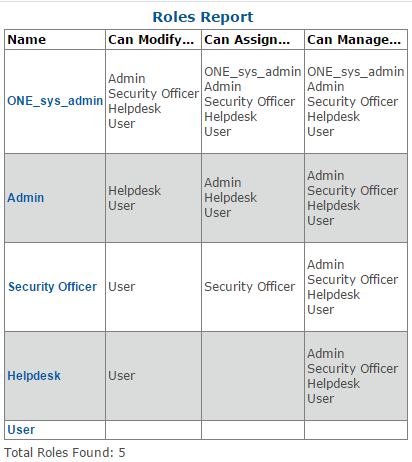

# Role Reports

The Cross Role Permissions report allows you to easily audit what other roles any given role can Modify, Assign or Manage.

To run a Cross Role Permissions Report:

1.	Select Reports submenu
2.	Click Cross Role Permissions link
3.	The Cross Role Permissions Report will be displayed.

**Note:**	

Sometime, it is necessary to quickly see which users have not enrolled yet, or to see a list of all “locked-out” users in the system. 

Reports are a great way to accomplish these tasks. To see which users have not enrolled, simply run a report By State, and select all of those users still in New Credential. 

Getting a feel for how states operate and what they mean can make managing users and maintaining your strong authentication deployment significantly easer.

