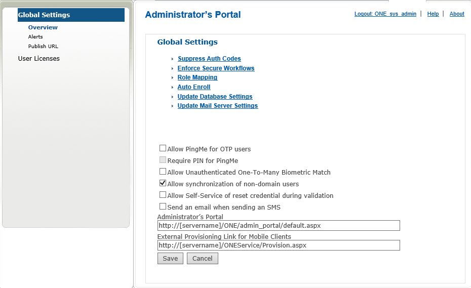

#Administering 2FA ONE: Settings

Within the Setting menu there are two sub-menus, they are:

1. **Global Settings:** Provides the ability to set global settings that affect the entire system. These settings cannot be individually assigned and when turned on or off will apply to all users. It also includes core system settings for your database and mail server.
2. **User Licenses:** Provides the ability to activate 2FA ONE Server and add User Licenses that are used to track use of managed credentials.
