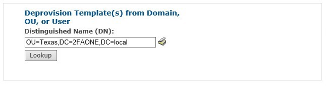

# Deprovision Templates

Deprovision Templates allow you to remove policy from a specific Domain, OU or User. 

Type the distinguished name and click Lookup You will be notified that proceeding will deprovision all applications specifically assigned to that Domain, OU or User.

!

