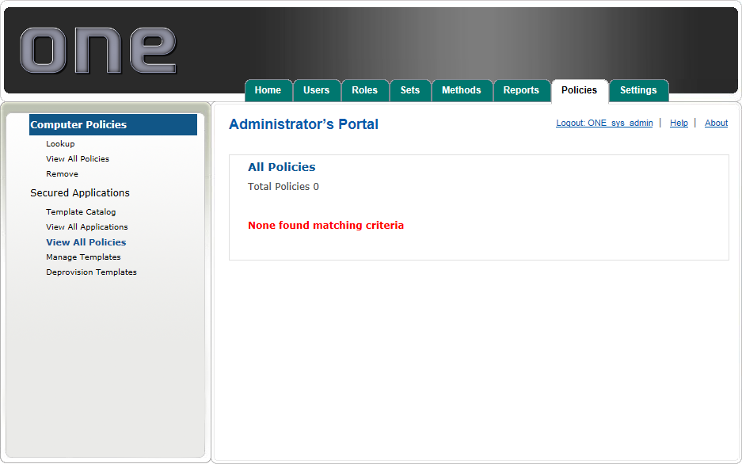
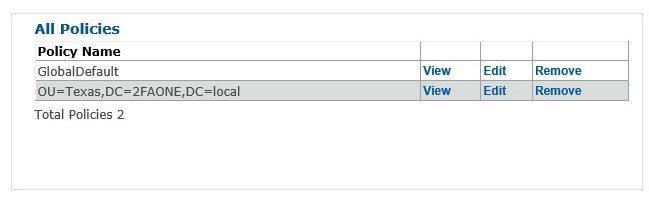

# View All Policies

Click View All Policies to view all policies assigned Globally, to all users in the system, or by Domain, OU or User

Click View next to a policy group to see the Template Name and Types currently assigned to that group. Templates applied as a result of parent policy will be indicated as *Inherited* 

Click Edit to add or remove templates assigned to that policy. 

Select a template and use the arrows to move template from the template catalog in the right pane to assign them to the policy in the left pane

To remove a policy, and prevent those applications from being pushed to users in the future, click Remove, then Deprovision Templates.
