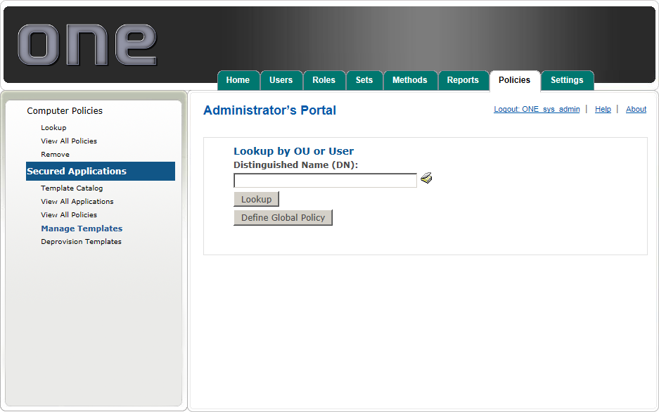
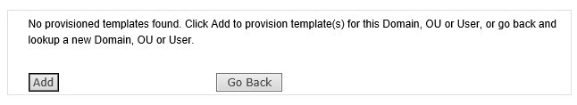
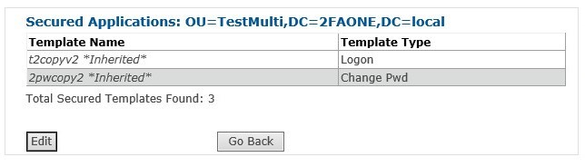

# Manage Templates

* Click Manage Template to view lookup policy by Domain, OU, or User. 
* Type the Distinguished name and click Lookup or use the AD Lookup tool to browse to the specific location. 
* Click Define Global Policy to create a policy that will be applied to all users in the system.

If no policy exists, you can click Add to assign a new policy to the currently searched user, or Go Back to return to the Manage Templates screen. 

If a policy already exists, you can view the templates and template types assigned to that policy. Click Edit to add or remove templates.

In the Edit Policy page, highlight templates on the right and move them to the left using the arrows to add them to the policy as desired. 

To remove templates, move them from the left pane to the right. Click Save to apply your changes. 

Note:	This will only prevent application templates from being pushed to users in the future. It will not remove the application template from users who have already received and used the template.
