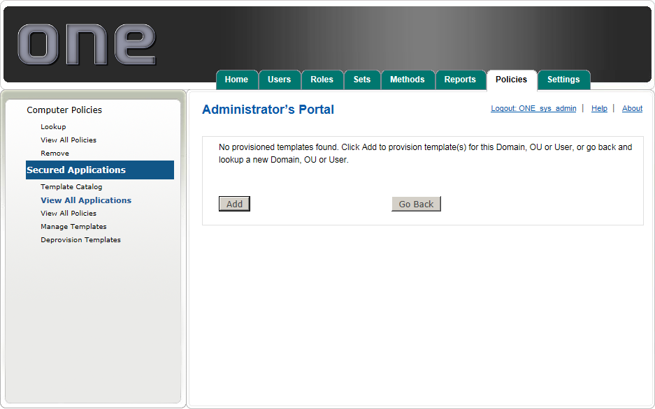
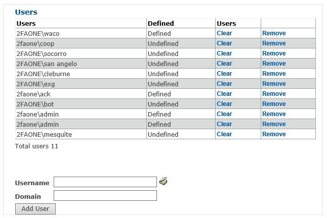
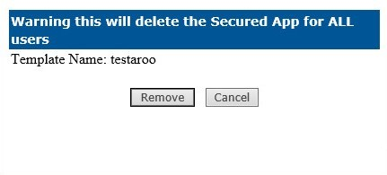

# View All Applications

Click View All Applications to view all Secured Application templates currently assigned to users. 

Click Users next to an application to see the list of users who currently have that template assigned. The Defined column indicates that their secured application template has been successfully configured with their user data Defined or no user data has been entered, Undefined. 

* Templates assigned to users with predefined AD data, may appear as Undefined until the template has been used for the first time.
* Click Clear then Remove to remove any saved username and password data, or click Remove then Remove to remove the template from a user altogether.
* To add a template to an individual user, type the username and domain, then click Add User

To delete a template entirely, and all associated user data, click Remove next to the appropriate template in the View All Applications screen, then click Remove to confirm. 

