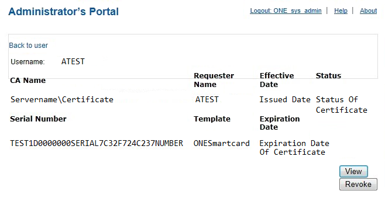
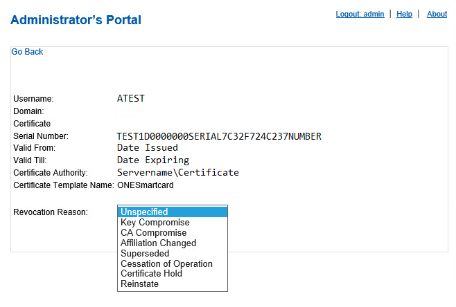
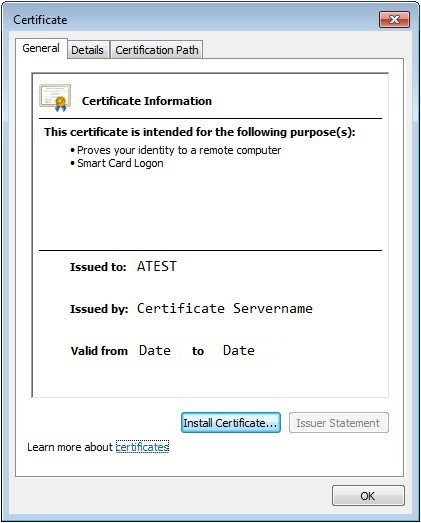

# Managing User Certificates

1.	When viewing the information for a user found in User Lookup, a User Certificates link will be present. The User Certificates link will display any certificate enrolled through 2FA ONE.
  2.	Click User Certificates.

2.	All certificates are listed with general information regarding the issuing CA, the certificate template name, and the valid dates. You may View or Revoke a user’s certificate from within 2FA ONE. 

3.	Click View to display Certificate Information. 
  4.	Note: Do not click Install Certificate... when viewing certificates from the Administrator’s Portal. Doing so will inadvertently install that user’s certificate in the administrator’s certificate store on his or her computer.
4.	Click Revoke to revoke the user’s certificate.
  5.	You must select a Revocation Reason from the dropdown list. 

5.	The revoked certificate will still appear in 2FA ONE, however once revoked the Revoke button is no longer active for that certificate. In the Status column, you will see that the certificate has status of Revoked. 
  6.	Though the certificate has been revoked and can no longer be used, the user remains in the Steady State If a new certificate is to be issued to that user, he must be removed from Steady State and placed into the correct state.

