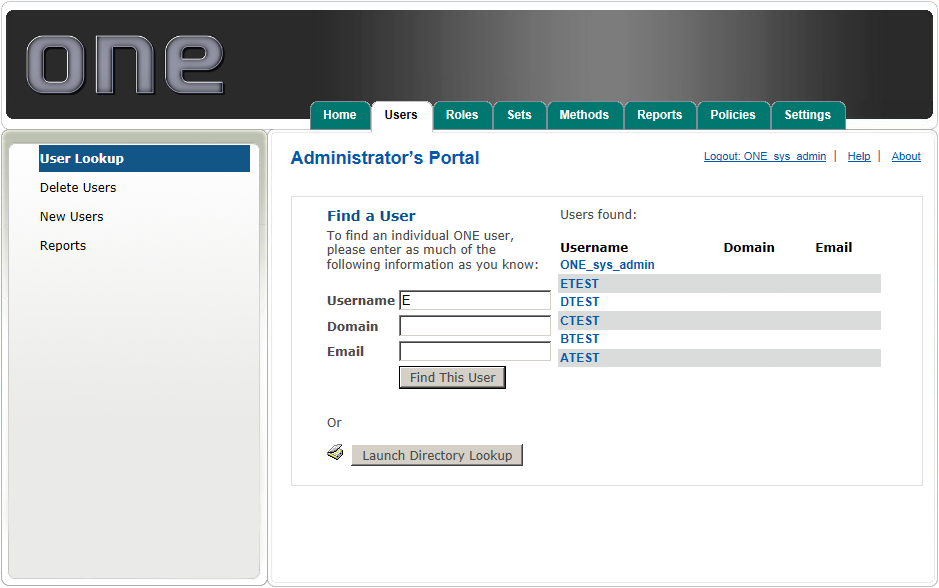
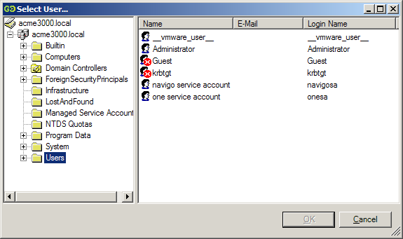

# User Look-up

The User Lookup submenu is used to find existing 2FA One Server users who are known to the system. 

### To find a specific user:
Enter as little or as much of the known user information in the:

* User Name, Domain, or E-Mail Fields
* Click 'Find This User'
* Alternatively, you may use the Directory Look-Up Tool

**Note:** You may perform truncated searches, such as E, will bring up all users who’s name starts with the letter E.

### Directory Look-up Tool
In order to launch the Directory Look-up Tool:

* 2FA One Server Drivers or 2FA One Client MUST be present on the system on which you are launching the tool.
* The account which you are logged on to Windows with MUST have read access to Active Directory
* And, the URL you are accessing must be in Trusted Sites.

** Note:** The 2FA One Server AD Lookup Tool supports a multi-domain forest; however, if a child domain is unavailable, the AD Lookup tool will take approximately 20 seconds to load for each child domain that cannot be connected