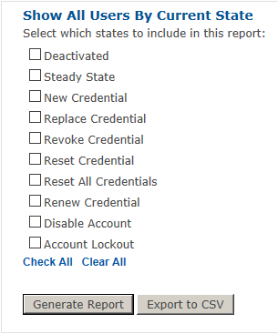
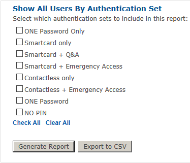
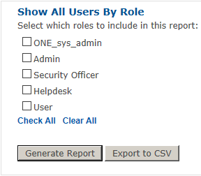

# User Reports

The User Reports menu enables you to search for users by State, by Authentication Set, or by Role.

### To run a report by State:

1.	Select Reports tab.
2.	Select the By State submenu.
3.	Select the states that you would like to report on by checking the appropriate check boxes. 
4.	Select Generate Report and the report appears on the screen.

### To run a report by Authentication Set:

1.	Select the Reports tab.
2.	Select the By Authentication Set submenu.
3.	Select the authentication sets that you would like to report on by checking the appropriate check boxes.
4.	Select Generate Report. The report appears on the screen.

### To run a report by Role:

1.	Select the Reports tab.
2.	Select the By Role submenu.
3.	Select the Roles that you would like to report on by checking the appropriate check boxes.
4.	Select Generate Report. The report appears on the screen.

**Note:**	After clicking Generate Report the results of the report will be displayed in a table.  Results listed in a bold blue are clickable links.

** Note:** In the steps above, you may alternatively click Export to CSV to generate a csv file that contains the output of the report that would have otherwise been generated on the screen.

