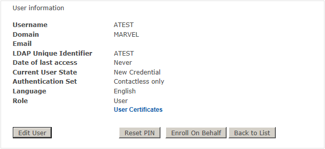
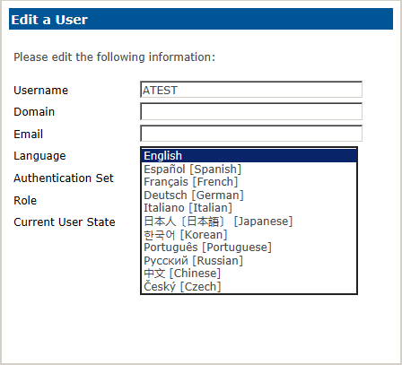
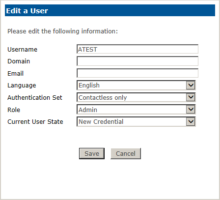
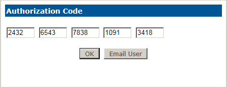

# Edit / Modify User Accounts To view or edit user information:

When you have found the user, all similar user names appear in a list on the right side of the screen.

Select from the list the user for which you need to perform administration.

The Managing 2FA ONE Server Users page appears. From this screen, you can select Edit User, Back to List, Enroll on Behalf, or Generate Offline Unblock.

**Note:** The Generate Offline Unblock button is only visible for users who enrolled via 2FA ONE Server with a mini-driver or .NET contact card.

**Note:** The Enroll on Behalf button is only enabled for users in the New or Replace Credential States with an Authentication Set for contact or contactless smart cards only. Enroll on Behalf is not enabled for users with AD, Q&A, or Emergency Access in their Authentication Sets.

Select Edit User. The Edit a User dialogue box appears. From this dialogue box, you can perform all 2FA ONE Server user-centric administration. 

In addition to the user name, if the user is a domain user with an assigned e-mail address, the data will appear in the associated fields.

The Language drop-down box enables you to set the language that will be
assigned to the user within the User’s Portal.

2FA ONE Server has integrated support for ten languages. They are: English, Spanish, French, German, Italian, Japanese, Korean, Portuguese, Russian, Chinese, and Czech. 

For multi-language to function correctly, the Microsoft®MUI - Multilingual User Interface - http://en.wikipedia.org/wiki/Multilingual_User_Interface environment must be installed on the computer on which you are viewing 2FA ONE Server, and to view Asian languages, a language pack from at least one of the supported Asian languages must be installed.

The Authentication Set drop-down box enables you to set the authentication set that will be assigned to the user. 

By default there are five sets enabled in 2FA ONE Server. These sets cannot be modified or deleted but new ones can be created.

### Default Authentication Sets:
**Smart Card Only:** Contact smart card enabled for Public Key Infrastructure logon to Windows.

**Smart Card and Q&A:** Contact smart card enabled for Public Key Infrastructure logon to Windows and Questions and Answers that are used for Secure Workflows within 2FA ONE Server.

**Smart Card and Emergency Access:** Contact smart card enabled for Public Key Infrastructure logon to Windows, Questions and Answers that are used for Secure Workflows within 2FA ONE Server and Emergency Access in conjunction with 2FA ONE Client.

**Contactless Only:** Contactless card enabled for logon to Windows in conjunction with 2FA ONE Client.

**Contactless and Emergency Access:**Contactless card enabled for logon to Windows in conjunction with 2FA ONE Client and Questions and Answers that are used for Secure Workflows within 2FA ONE Server and Emergency Access in conjunction with 2FA ONE Client

### Default Roles

The Role drop down box enables you to set the 2FA ONE Server Role that will be assigned to the user. Users can be set to any 2FA ONE Server Role previously defined within the system, for which the current administrator has role assignment permissions.

### User State

The Current User State drop down box enables you to set the user’s state within 2FA ONE. The user’s state defines the user’s experience within the User Portal.

There are eight assignable states within 2FA ONE Server:

**Deactivated:** The user can no longer access the system. Before a user account can be permanently deleted from the 2FA ONE Server database, they must first be Deactivated in the system. This process ensures accounts are not inadvertently deleted. Once Deactivated, a user account can only be placed in Steady State or New Credential. Users in this state will not be able to log on to the 2FA ONE Server User Portal.

**Steady State:** The previously assigned user state was completed and the user requires no additional assistance. Users in this state will be presented the normal 2FA ONE User Portal home page.

**New Credential:** The user has been assigned a new credential, but has not activated the credential. Set this state for new users. Users in this state will be greeted with the “New Credential” workflow when logging
into the 2FA ONEServer User Portal. The workflow will consume User License(s).

**Replace Credential:** The user has lost his credential and requires a replacement. Use this state for lost card scenarios when the user requires a replacement. Replace Credential only replaces the user’s primary authentication method(s). If the user was previously in Steady State and was a Smart Card or Contactless user, setting the user to Replace Credential will also revoke the user’s prior credential. Users in this state will be greeted with the “Replace Credential” workflow when logging into the 2FA ONE Server User Portal. The workflow will consume User License(s).

**Revoke Credential:** The user credential has been compromised or a revoke request has been received from the user or appropriate authority. This state will revoke all of the user’s primary authentication methods. If
the user is not changed to another state following being placed in revoke, the user will not be able to access the 2FA ONE Server User Portal.

**Reset Credential:** This workflow is for primary authentication methods only. Use this state if the user has a blocked credential that must be unlocked or unblocked. Use this state for blocked cards or blocked Q&A
when Q&A is a primary method. Users in this state will be greeted with the “Reset Credential” workflow when logging into the 2FA ONE Server User Portal.

**Generate Auth Code:** This workflow is to generate a new Auth Code for a user who was previously issued an Auth Code, but for whatever reason requires a replacement.

**Reset All Credentials:** The user has locked or blocked more than one credential and must unlock or unblock more than one credential. Use this state for locked smart cards and blocked Q&A. This state will walk the user through a reset of all assigned credentials, including those used for secure workflows. Because of this, care should be taken before allowing a user to reset all credentials. Users in this state will be greeted with the “Reset Credential” workflow when logging into the 2FA ONE Server User Portal.

**Disable Account:** Is only available when the AD Method is set up in Methods and if the user is a member of the domain for which the AD Method was established. Once set, 2FA ONE Server will disable the user’s associated Active Directory Account and set the user’s 2FA ONE Server account to Deactivate. Once the user has been placed in this state, the user will no longer be able to log on to the domain; however, their
credential will still be valid, such as their previously issued PKI certificate. To re-enable the account, set the user back into Steady State or New Credential. 

**Renew Credential:** This workflow is for primary authentication methods only. Use this state if the user requires to renew their primary credential such as a digital certificate located on a Contact smart card card. Users in this state will be greeted with the “Renew Credential” workflow when logging into the 2FA ONE Server User Portal. This workflow does not consume a User License.

After you have entered/edited the appropriate user information, click Save
to commit the changes or Cancel to exit.

If you elected to globally enable the Authorization Code, after you have saved your changes, the Authorization Code dialogue box will appear with the assigned authorization code. 

This only appears when 2FA ONE Server has detected changes that would normally require an authorization code to be presented by the user. You can either read or e-mail it the Authorization Code to the user.

Note: In the event an administrator makes a change within Edit User and clicks the “X” button on the top-right of the pop-up the application will warn the administrator that changes have not been saved.

**Note:** The setting that allows you to email an Authorization Code is configured during the installation and setup process. Information on completing this setup is provided in the Installation and Setup Guide. 

To Turn Auth Codes on or off, go to the Settings tab in 2FA ONE Server.

Selecting Back to List within the Edit a User window will return you to the User Lookup results.
